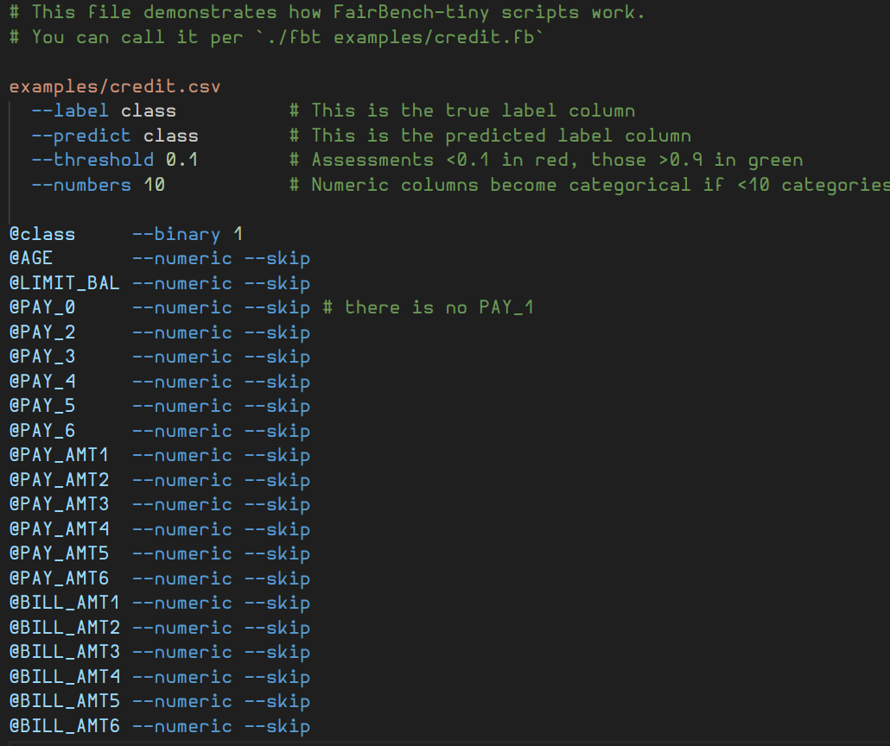
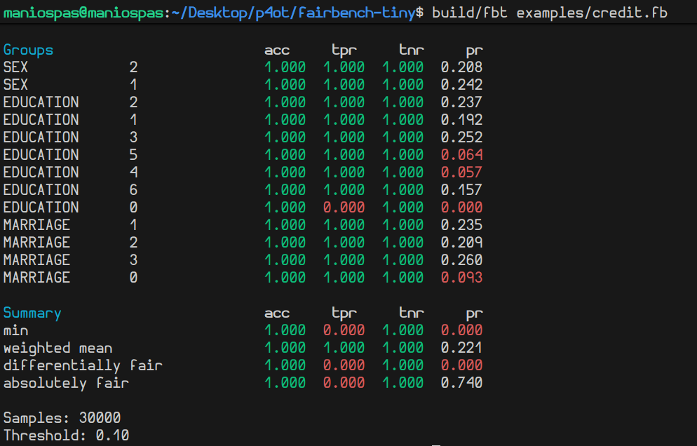

# fairBench-tiny

*Fairness metrics at wire speed.*

This is a high-performance C utility for evaluating basic fairness metrics from large tabular datasets.  

It provides a lightweight alternative to the [**FairBench**](https://github.com/mever-team/FairBench) Python framework for bias and fairness assessment. This variation is ideal for environments where speed and memory efficiency are critical by streaming through a file and accumulating values without loading all data in memory.

## 🔥 Features

- Fast parsing of large CSV/TSV files with bare metal code.  
- Aggregate group-wise metrics for classification (tpr, tnr, accuracy, pr).
- Color-coded output and exit codes for failing analysis. 
- Minimal energy footprint in a few kB of memory - set up as a worker.
- Expressive arguments that can be read from *.fb* scripts to revisit complicated analysis.
- Streaming interface.

**Intentional limitations** 

When the assumptions below are violated, *fbt* will exit with error code 2. All can be addressed given adequate interest, but they are chosen for fast implementation that addresses many realistic scenarios.

- Each cell must comprise up to 127 characters. This is a constant in *src/data.h* that you can change and recompile.
- File lines are assumed to span up to 4kB. This is also a constant in *src/data.h*.
- Up to 64 cols can be analyzed. This is also a constant in *src/data.h*.
- The employed hashing algorithm for categorical column values may consume much more memory than expected (still in the order of magnitude of some kBs at most). This algorithm is chosen for the sake of speed, so there is a soft (and unknown) upper limit
on the number of different categorical attribute values that can occur - ideally these should be less than 80.

## ⚡ Quickstart

Download the *./fbt* executable from the project's 
[latest release](https://github.com/maniospas/fairbench-tiny/releases/latest).
If you have an issue, want to contribute, or your platform is not supported, clone this repository and run `make`. This will create the executable `build/fbt`.

Run the executable:

```bash
./fbt data.csv [--label colname] [--predict colname] [--threshold value] [--members min_count]
```

*data.csv*  is the path to the CSV/TSV data file to analyze. If no path is provided, the *stdin* is polled every 100ms to read analyzed data from there and provide live updates. If the path ends with *.fb*, the file is assumed to be a saved script instead - see below.

**Data args**

- --label &lt;colname> Name of the column containing true labels (default: *label*).
- --predict &lt;colname> Name of the column containing predicted labels (default: *predict*).
- --threshold &lt;value> Highlight values below this fairness threshold in red, and above 1-threshold in green (default: 0.0). Violated thresholds make the final report return with exit code 1.
- --numbers &lt;value> Declares that numerical data columns with less than the number of distinct values should be treated as categorical. For example, you might have values 1,2,3 for marital status, where the identifiers are explained elsewhere.
- --members &lt;value> Minimum number of samples required for a group to be included in the fairness report. Groups with fewer members are ignored. Default is 1. You can set this value to zero to also show groups that are not present in your data (for example, explicitly or implicitly mentioned in *.fb* scripts).

**Streaming args**

- --stream &lt;rows> Stream an update after every fixed number of seconds. If this is set and no path is provided, you get live updates from *stdin*. Streaming mode never terminates.
- --forget &lt;rate> Sets a forget rate in the range `(0,1]` that degrades the importance of earlier samples. Its value should be small (e.g., 0.01 or much smaller). Particularly useful when streaming over time.

**Visual args**
- --bars Shows values as bars instead.
- --details Shows computation details - not only the summary.

**Column args**

- @&lt;NAME> Switches to declaring column-specific characteristics. These are presented next.
- --numerical Indicates that the column holds numerical data (this is prioritized over the globally set --numbers).
- --skip Ignores the column during parsing.
- --binary &lt;label> Sets the column as a binary categorical attribute with a given positive label.
- --char &lt;from>&lt;to> Sets a categorical column whose elements can be distinguished based on their first character. Provide a range of ASCII characters, starting from the first and ending at the second one (inclusive). Other values are grouped in a different category. For example, set `--char AD` for a column with possible entries *Apple,Banana,Durian,Watermelon*, where the range *AD* suffices to identify the first three options, and the other can be categorized into *other*. **This operation is the fastest option for processing categorical attributes.**

<details> 
<summary>More about --chars</summary>

*There is no downside to this strategy other than discounting bytes after the first and requiring manual specification.* It consumes less memory and is faster than other options, because it does skips memory indirection and expensive hash computations. Examples: <br>
`--char 03` separates column values into those starting with *0,1,2,3*, and *other*.<br>
`--char BD` separates column values into those starting with *B,C,D*, and *other*.<br>
`--char yy` denotes that only the categorization *y* vs *other* is expected. Unlike `--binary`, this does not yield a numerical value but creates a categorical split.

</details>

## 📝 Script files

You might have complex arguments in your run that would be a shame to lose.
In those cases, pass as the only argument a configuration *.fb* file like the ones in *examples/*. 
Scripts can be accompanied by command line arguments, but this behavior is not 
well-defined right now in case of conflicts - you will either see an error or the command line
arguments are overwritten, and this behavior will likely change in the future.

Run script files like below:

```bash
./fbt examples/credit.fb
```

Here is an example script, where code highlighting comes from a VScode extension (look for the 
<i>FairBench Tiny Syntax</i> extension). The outcome reports only on the columns of interest.

<div style="display: flex; justify-content: center; gap: 1rem; flex-wrap: wrap;">
  <figure style="text-align: center;">
    <br>
    <figcaption>Example <i>.fb</i> script.</figcaption>
  </figure>
  <br>
  <br>
  <figure style="text-align: center;">
    <br>
    <figcaption>Resulting fairness report.</figcaption>
  </figure>
</div>


## 📘 Expected input

The first data line must contain column headers (group names, *label*, and *predict*). Columns may be separated by **comma `,`**, **tab `\t`**, or **semicolon `;`** — the first of those delimiters that is encountered is used from thereon.
**Whitespace** or **quotations** `"` are ignored everywhere.  

All rows must have the same number of columns as the header, and must contain categorical or numerical data values at every column. For predictions and labels, if no column specifications are provided, values are considered binary identified by whether column entries start with *y*, *Y*, or *1*.

```csv
gender,region,label,predict
1,0,1,1
0,0,0,0
1,1,1,0
0,1,0,1
```

## ✨ Streaming interface

You can monitor running algorithms by flushing predictions to the executable's *stdin*. For example, in Linux you can pipe the *stdout* of a Python process like below. The example uses a Python script that emulates an algorithm outputting results.

```python
# examples/streamer.py
import time
import sys
import random

# --- Write header ---
sys.stdout.write("gender,region,label,predict\n")
sys.stdout.flush()

while True:
    gender = random.choice(["man", "woman", "other"])
    region = random.choice(["here", "there", "everywhere", "nowhere"])
    label = random.choice(["0", "1"])
    predict = random.choice(["0", "1"])
    sys.stdout.write(f"{gender},{region},{label},{predict}\n")

    if random.random() < 0.05:
        sys.stdout.flush() # randomly flush for demonstration
    time.sleep(0.01) # mimics a slow algorithm (not needed)
```

```bash
python3 examples/streamer.py | ./fbt --stream 1
```


## 🧪 Benchmarks

Benchmarks are lies. But they are useful lies. So here is a comparison using the *perf* tool on a Linux machine
to repeat a credit dataset analysis 10 times for consistency. Approximate ranges of consumed resources are reported for the task of computing 
absolute positive rate differences between two sexes on the *Credit* dataset. This is done using AIF360 (a very popular fairness analysis library), FairBench, and FairBench-tiny. 

Honestly, there is not much to expect from a comparison of an interpreted vs a compiled framework; the latter will always dominate. But below is a validation of this common engineering truth anyway. Python 3.13.1 is used everywhere.

| Framework | Runtime (sec) | Energy (Joules) | Memory (MB) |
|------------|--------------|-------------|--------------|
| **Pandas + AIF360** | 0.72–0.80 | 24-29 | <170 | 
| **Pandas + FairBench** | 0.35–0.36 | 12–13 | <98 | 
| **FairBench-tiny** | **0.01–0.03** | **0.4–0.8** | **<2** | 

Python libraries cannot be decoupled from their interpreter in this use case of analyzing a dataset (and potentially predictions) stored in disk. So the above numbers include interpreter startup and dataset loading overheads that consume 0.33–0.36 sec and 12–14 Joules. If these are ignored, FairBench's internal NumPy usage (which wraps compiled code) ends up also being lightweight.

While acknowledging that huge gains are pretty normal when comparing Python vs C implementations, FairBench-tiny achieves:

- &gt;17x lower energy consumption compared to the other frameworks.
- &gt;30x faster execution.  
- &gt;50x lower memory usage. Because the input file is streamed instead of being read completely first. This is the greatest gain from an engineering standpoint. 

Commands for transparency and future replicability:

```bash
make
sudo perf stat -e power/energy-pkg/ build/fbt examples/credit.fb
/usr/bin/time -v build/fbt examples/credit.fb
```